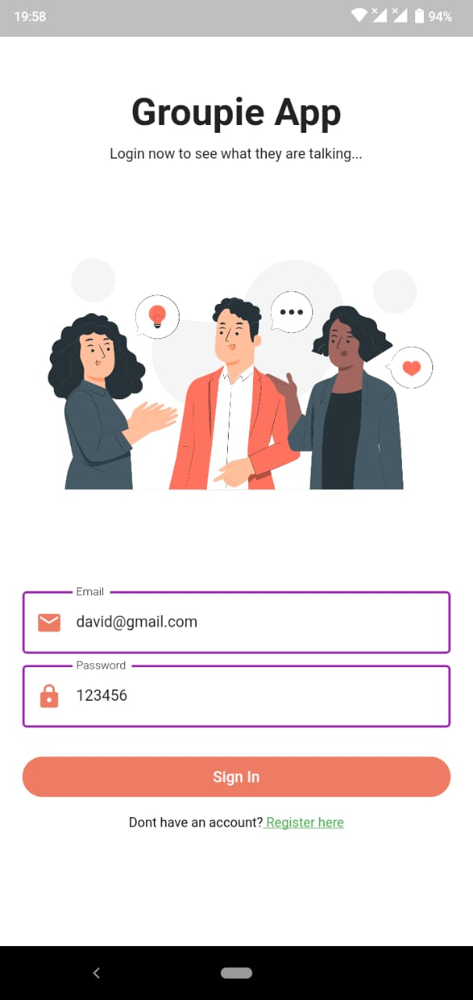
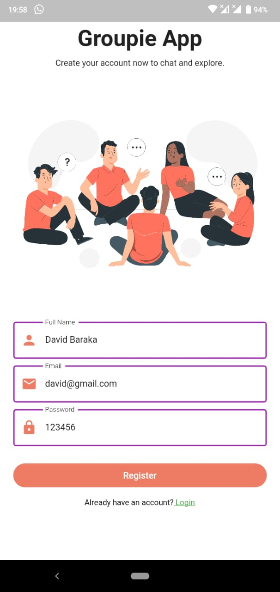
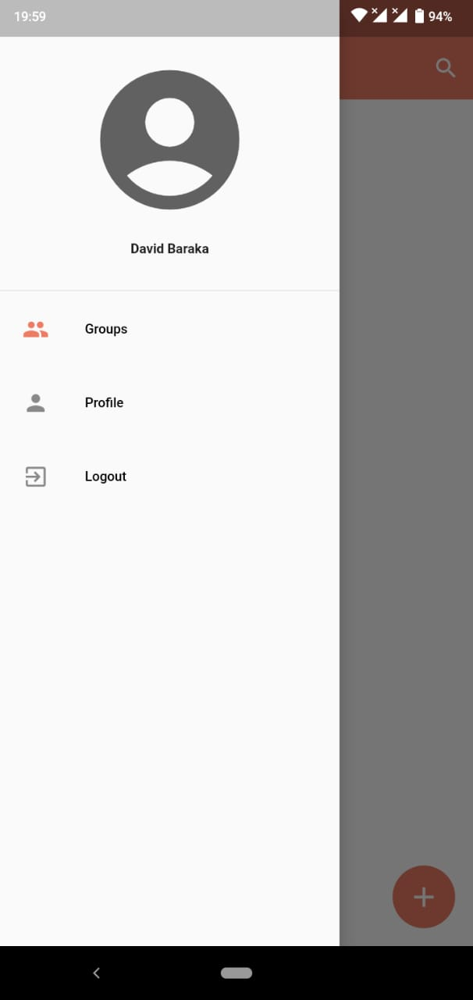
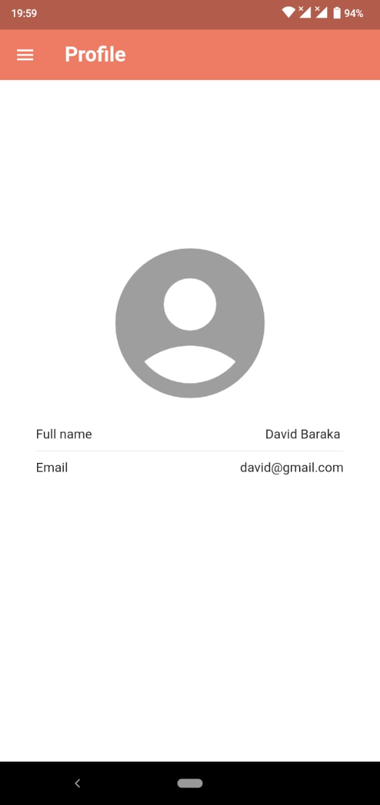
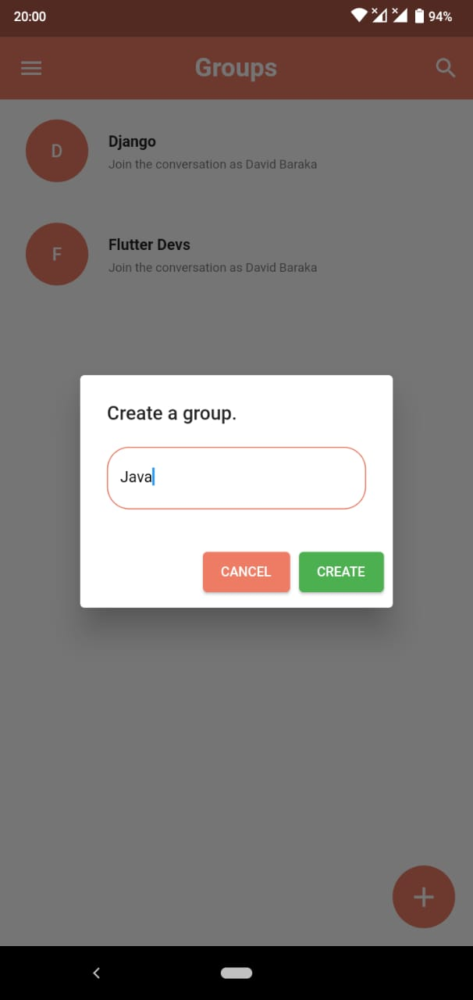
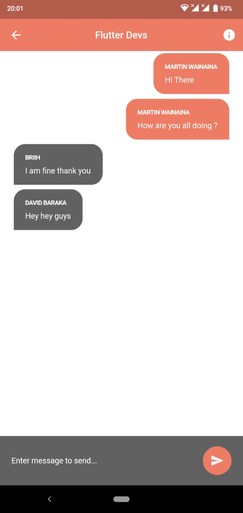
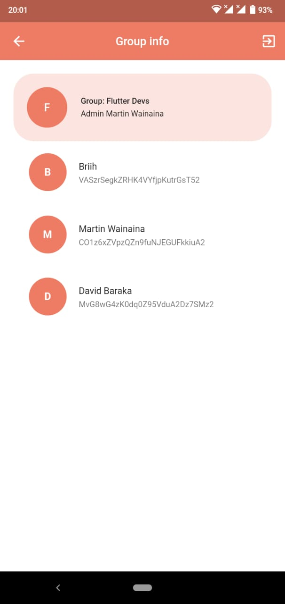
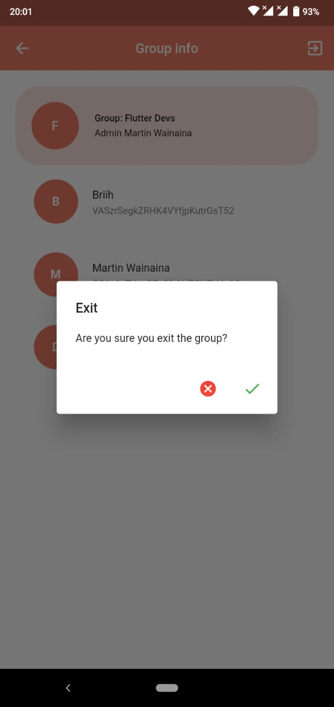
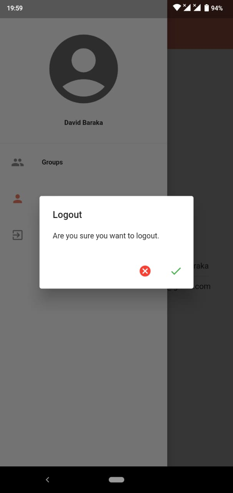

# chat_app_flutter

A new Flutter project.

## Getting Started

This project is a starting point for a Flutter application.

A few resources to get you started if this is your first Flutter project:

- [Client authentication](https://developers.google.com/android/guides/client-auth)
- [Youtube tutorial](https://www.youtube.com/watch?v=Qwk5oIAkgnY&t=704s&ab_channel=BackslashFlutter)
- [Tutorial link](https://github.com/backslashflutter/group_chatapp_flutter_firebase)
- [Images](https://drive.google.com/file/d/1yqDo2_gDkmfVOnYCoT5uElUSXv9aZpcO/view)

## Images preview.
1. login
- 
2. register
- 
3. drawer
- 
4. profile
- 
5. profile
- 
6. create group
- 
7. chat
- 
8. group infor
- 
9. exit group
- 
10. logout
- 

## Generate SSH i.e Using terminal or in android studio.
1. Using terminal
- [Generate SHA 1 Key In Flutter On Windows](https://www.youtube.com/watch?v=wGOTwojezy8&ab_channel=BackslashFlutter)
  1.1 For creating the keystore file i.e., debug.keystore... run following in terminal

      keytool -genkey -v -keystore debug.keystore -alias androiddebugkey -storepass android -keypass android -keyalg RSA -keysize 2048 -validity 10000

1.1 For viewing the SHA-1 key from the keystore file that we created

      keytool -list -v -keystore %USERPROFILE%\.android\debug.keystore -alias androiddebugkey -storepass android -keypass android

- Result is:

        Certificate fingerprints:
         SHA1: D3:A6:B9:C8:30:69:0B:DE:D7:32:F2:57:AA:7E:C0:BF:D5:1E:E2:7A
         SHA256: 72:B1:3F:D8:12:10:AC:36:85:0E:90:63:C7:B7:FF:0B:0A:3C:23:43:09:DE:C0:A8:E9:2E:06:98:B5:79:7E:02
  	Signature algorithm name: SHA384withRSA
  	Subject Public Key Algorithm: 2048-bit RSA key
  	Version: 3
  	
  	Extensions:
  	
  	#1: ObjectId: 2.5.29.14 Criticality=false
  	SubjectKeyIdentifier [
  	KeyIdentifier [
  	0000: B1 5A 2E 4B 3C D3 E6 07   F1 D6 59 32 59 DF FE D1  .Z.K<.....Y2Y...
  	0010: CE 82 C4 BF                                        ....
  	]
  	]

2. Using terminal(must have gradlew):

   gradlew signingreport


- To get the debug certificate fingerprint(password is "android"):

        keytool -list -v -keystore debug.keystore -alias androiddebugkey


## Obtaining package name:
- iOS:
- In iOS the package name is the bundle identifier in Info.plist. which is found in Runner.xcodeproj/project.pbxproj:

      PRODUCT_BUNDLE_IDENTIFIER = com.example.chatAppFlutter; 
- place the GoogleService-Info.plist  inside iOS/Runner <br>
- Android: 
- In Android the package name is in the AndroidManifest:

      <manifest xmlns:android="http://schemas.android.com/apk/res/android"
       ...
       package="com.example.appname">
- place the google-service.json  inside android/app <br>

## Adding firebase to flutter app.
- [Pub dev link](https://pub.dev/packages)
- [Pub dev firebase_core link](https://pub.dev/packages/firebase_core/install)
- Add firebase_core, run: 

       flutter pub add firebase_core
- Add firebase_auth, run:

        flutter pub add firebase_auth
- Add cloud_firestore, run:

        flutter pub add 
- Add shared_preferences, run:

        flutter pub add shared_preferences

## Running the web app
- Navigate to current project directory i.e. C:\Users\Administrator\AndroidStudioProjects\chat_app_flutter>
- Then run the following command so as to run web app

```
flutter run -d chrome
```